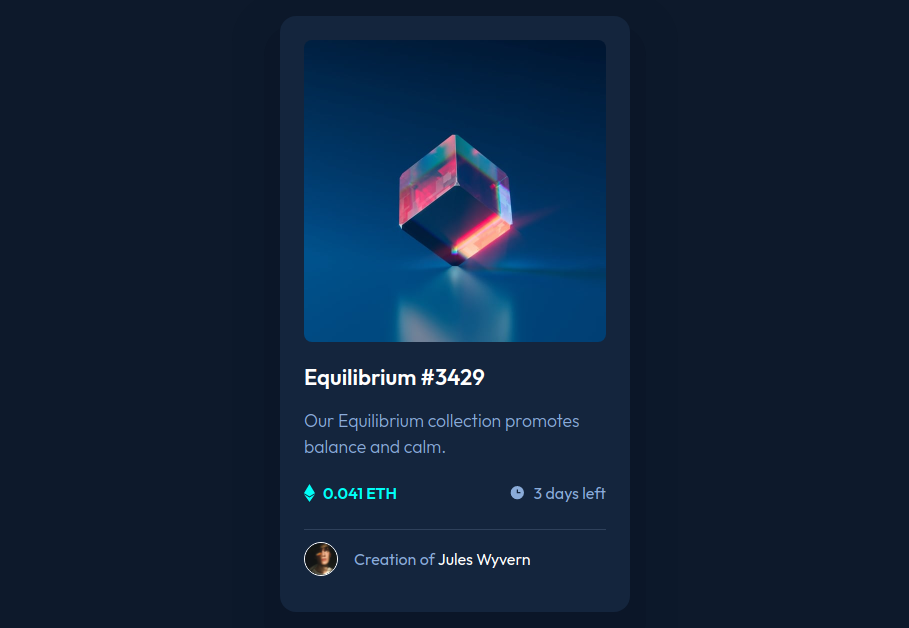

# Frontend Mentor - NFT preview card component solution

This is a solution to the [NFT preview card component challenge on Frontend Mentor](https://www.frontendmentor.io/challenges/nft-preview-card-component-SbdUL_w0U). Frontend Mentor challenges help you improve your coding skills by building realistic projects. 

## Table of contents

- [Overview](#overview)
  - [The challenge](#the-challenge)
  - [Screenshot](#screenshot)
  - [Links](#links)
- [My process](#my-process)
  - [Built with](#built-with)
  - [What I learned](#what-i-learned)

## Overview

### The challenge

Users should be able to:

- View the optimal layout depending on their device's screen size
- See hover states for interactive elements

### Screenshot

### Links

- [View Live Solution](https://creative-cookie.github.io/nft-preview-card/)

## My process

### Built with

- HTML
- CSS
- Flexbox
- CSS Grid

### What I learned
Since I was unfamiliar with working with svg files, I took the time to research this file format and learned about the various ways svg artwork is created and how it can be used within HTML files and styled with CSS. I also did a little bit of research into various ways on how to get the view icon to appear when the main image was rolled over and decided to go with Grid to accomplish this.
